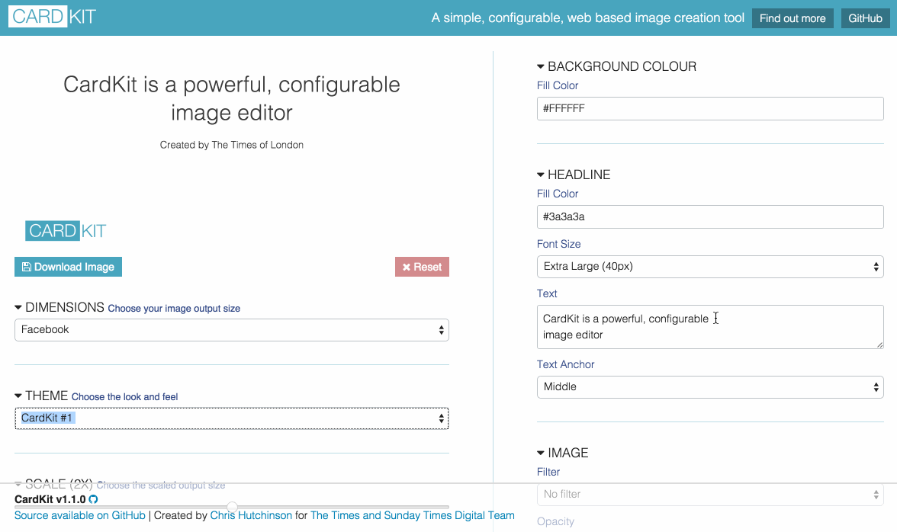

# CardKit

## Version 1.1.1

### 2016 [Chris Hutchinson](http://www.github.com/chrishutchinson) for The [Times and Sunday Times](http://www.github.com/times)

CardKit is flexible, SVG image / card creation tool, with simple configuration options, which is easy to extend.

<!---->

CardKit is aimed at newsrooms, however has many potential uses that extend beyond that:

- Coupon and offer images
- Templated asset generation
- Video preview images (e.g. 16:9)
- Educational resources
- Marketing and promotion
- Personal branding

## Twitter

Follow [@CardKit](http://www.twitter.com/cardkit) on Twitter for the latest news, updates and tutorials.

## Project origins

You can find out more about the origins of CardKit [here](https://medium.com/digital-times/how-we-used-an-open-source-meme-generator-to-promote-our-journalism-a0f963aa7465).

## Roadmap

See `ROADMAP.md`.

## Setup, configuration and deployment

See the [CardKit Wiki](https://github.com/times/cardkit/wiki) for guides on how to build with CardKit

#### Push to `gh-pages`

If you want to use [GitHub Pages](https://pages.github.com/) to host your build of CardKit, follow this to push your `/dist` folder: https://gist.github.com/cobyism/4730490

## Version history

**1.1.1** (June 12, 2016)

- Fix: Hover rectangle is now removed correctly in all cases (#45 - thanks @satotake)

**1.1.0** (February 22, 2016)

- Add support for images to be editable via a drop down, as well as through file upload
- Allow dragging to be locked to a single direction through configuration
- Allow themes and sizes to have a default set
- Enable element attaching on the Y-axis, so that elements can be attached to elements above them, and move as they expand
- Add a configuration options to add a bounding-box when dragging elements, to give an understanding of their size
- Add support for variable line height, defined in the configuration object

**1.0.0**

- Initial release
